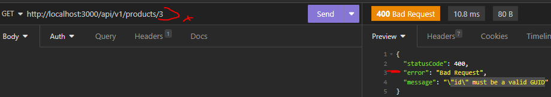
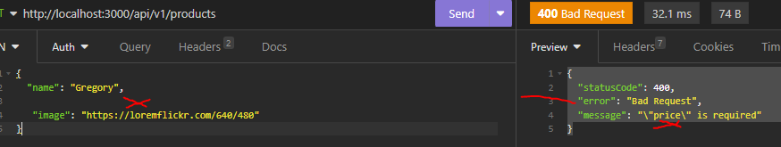

# las unicas modificaciones se hicieron en los archivos : 

dependecias nuevas : npm i joi , documentacion  npm docs joi

router/products.router.js : es donde vamos a usar le MID de validacion de forma local 

services/product.service.js : no

middlewares/validator.handler.js :no

index.js : no

Ejemplo :no

